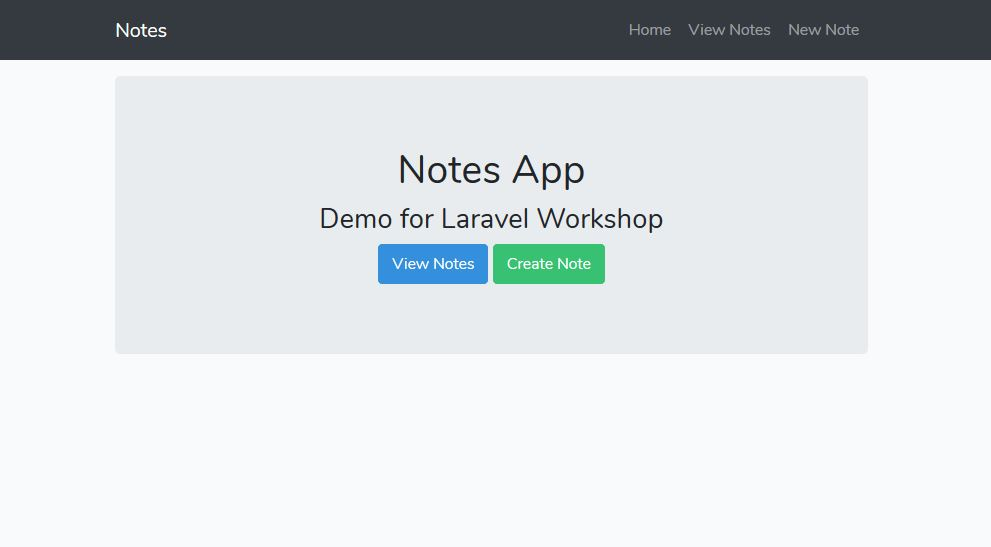
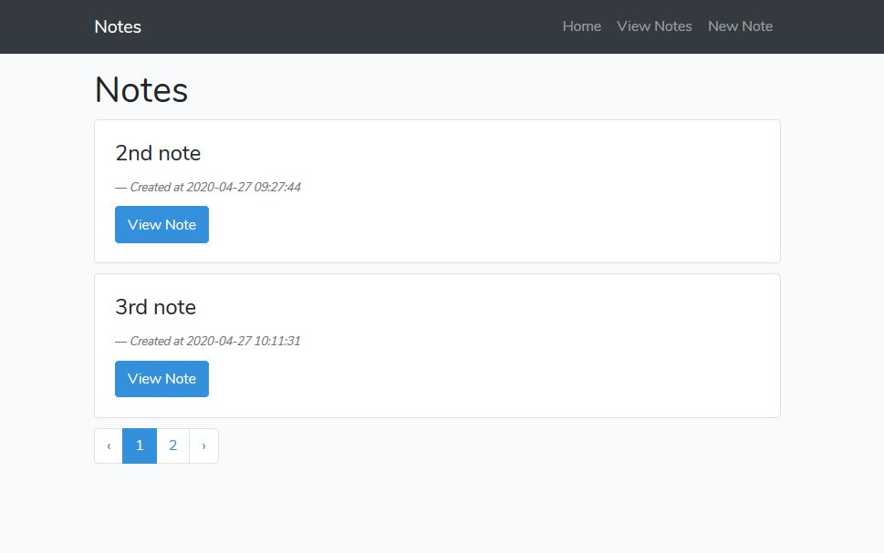
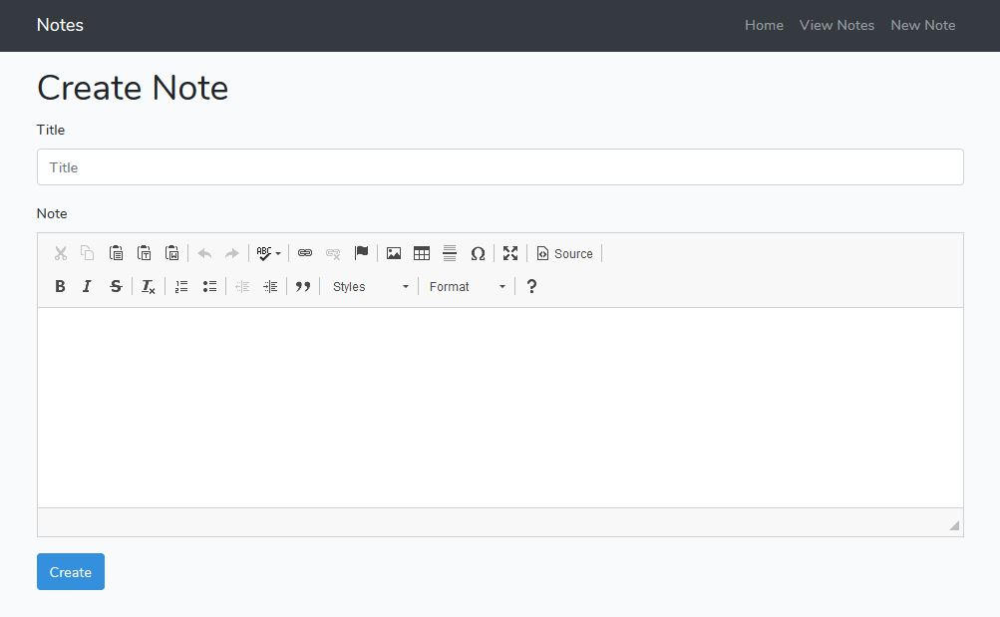
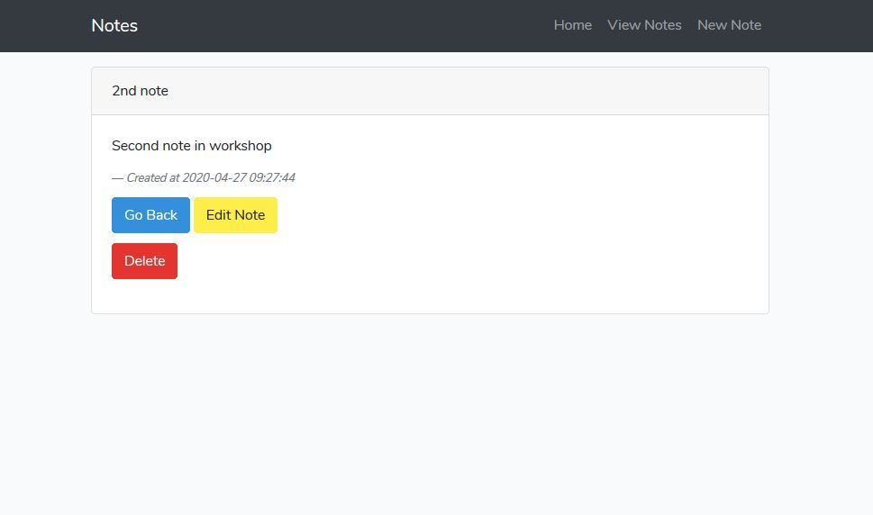

# Notes-App
## Created as a demo for conducting an online workshop for [VESIT](https://ves.ac.in/vesit/).

### Screenshots
 <br><br>
 <br><br>
 <br><br>
 <br><br>

## Installation Steps
1. Install [XAMPP](https://www.apachefriends.org/index.html).

2. Intall [Composer](https://getcomposer.org/). Put correct path for PHP during installation. The file _php.exe_ is in _php_ directory in the XAMPP installation folder.

3. Install [Node.js](https://nodejs.org/en/) along with npm.

4. In _xampp/htdocs_ run command:
```
php artisan create-project laravel/laravel notes
```
5. In _xampp/apache/conf/extra_ add follwing lines to _http-vhosts.conf_ file:
```
<VirtualHost *:80>
    DocumentRoot "path/to/htdocs"
    ServerName localhost
</VirtualHost>

<VirtualHost *:80>
    DocumentRoot "path/to/public/of/project"
    ServerName notes.ves
</VirtualHost>
```
6. Open Notepad as administrator and add follwing lines to _hosts_ file in _C:\Windows\System32\drivers\etc_ :
```
127.0.0.1 localhost
127.0.0.1 notes.ves
```
7. Install [Git and Git Bash](https://gitforwindows.org/).

8. Inside your project directory, run the following commands in a bash shell:
```
composer require laravel/ui
composer require laravelcollective/html
php artisan ui bootstrap
npm install
npm run dev
```
9. Create controller along with predefines routes:
```
php artisan make:controller NotesController --resource
```
10. Add the follwing line in _web.php_ file in _routes_ directory.  
```
Route::get('/', function () {
    return view('home');
});

Route::resource('notes','NotesController');
```
11. Check routes using:
```
php artisan route:list
```
12. Create a database "notes" from PhpMyAdmin. Set MySQL database credentials in _.env_ file. Make database model for notes using:
```
php artisan make:model Note -m
```
13. Add following line to _AppServiceProvider.php_ in _app/Providers_ directory:
```
use Illuminate\Support\Facades\Schema;
```
14. In the same file, add this line to _boot()_ function:
```
Schema::defaultStringLength(191);
```

15. Add all views and layouts (resources/views), controller functions (app/Http/Controllers/NotesController.php), model details (app/Note.php) and migrations (database/migrations/create_notes_table.php). Run the follwing command:
```
php artisan migrate
```

16. Download and add CKEditor files to your public folder. Refer this [article](https://artisansweb.net/install-use-ckeditor-laravel/).

17. We have already installed laravel collectives. Make changes to _config/app.php_ as shown [here](https://laravelcollective.com/docs/5.6/html).

18. Make sure that the Apache server and MySQL are running. The project site will be visible at _http://notes.ves_. This will be your local server, website won't be accessible via web.